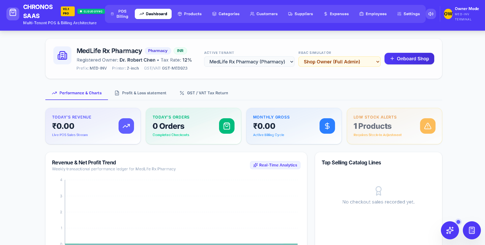
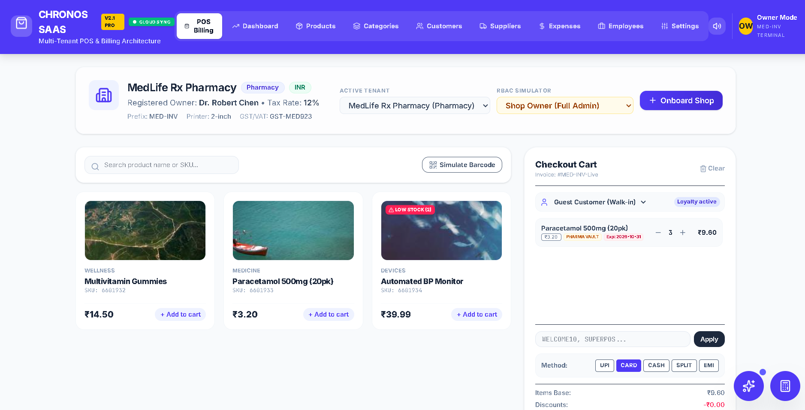

# 🚀 Chronos SaaS

> Cloud-Based Multi-Tenant POS, Billing & Inventory Management Platform




---

## 🌐 Live Demo

**Try the application here:**

https://e-commerce-billing-platform-with-scientific-calcu-16930122928.asia-southeast1.run.app

---

# 📖 Overview

Chronos SaaS is a modern cloud-based POS, Billing and Inventory Management platform built using **React, TypeScript, Firebase and Google Cloud Run**.

The application enables retailers, pharmacies, supermarkets, restaurants and small businesses to manage products, inventory, customers, suppliers and invoices from a single dashboard.

---

# ✨ Features

- 🛒 POS Billing
- 📦 Inventory Management
- 👥 Customer Management
- 🚚 Supplier Management
- 📄 Invoice Generation
- 📊 Sales Dashboard
- 📈 Analytics
- 🔥 Firebase Database
- ☁ Google Cloud Run Deployment
- 📱 Responsive Design
- 🧮 Advanced Scientific Calculator
- ⚡ Real-Time Data Sync

---

# 📸 Screenshots

## Dashboard


## POS Billing



---

# 🛠 Tech Stack

- React
- TypeScript
- Firebase
- Firestore
- Express.js
- Node.js
- Google Cloud Run
- Vite

---

# 🚀 Installation

```bash
git clone https://github.com/chirag283/E-Commerce-Billing-Platform-with-Scientific-Calculator.git

cd E-Commerce-Billing-Platform-with-Scientific-Calculator

npm install

npm run dev
```

---

# 🌟 Future Enhancements

- AI Sales Analytics
- Barcode Scanner
- QR Billing
- Razorpay Integration
- Stripe Payments
- Mobile App
- Email Invoice
- PDF Invoice

---

# 👨‍💻 Developer

**Chirag Jangid**

📧 chirag2002jangid@gmail.com

GitHub

https://github.com/chirag283

---

# 📄 License

This project is licensed under the MIT License.

⭐ If you found this project useful, please give it a star.
